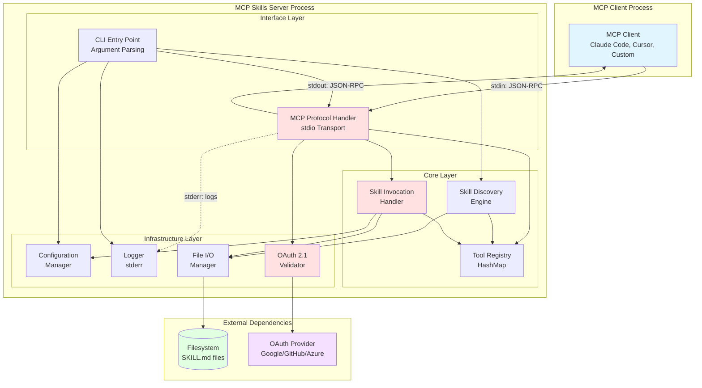
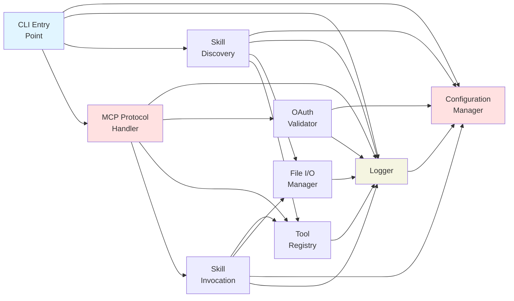
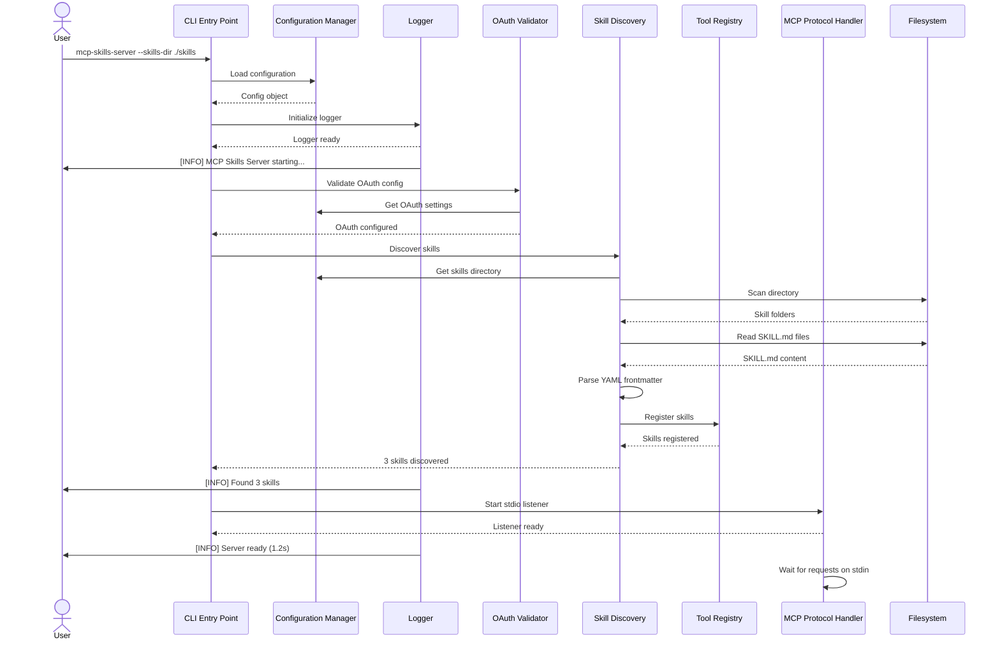
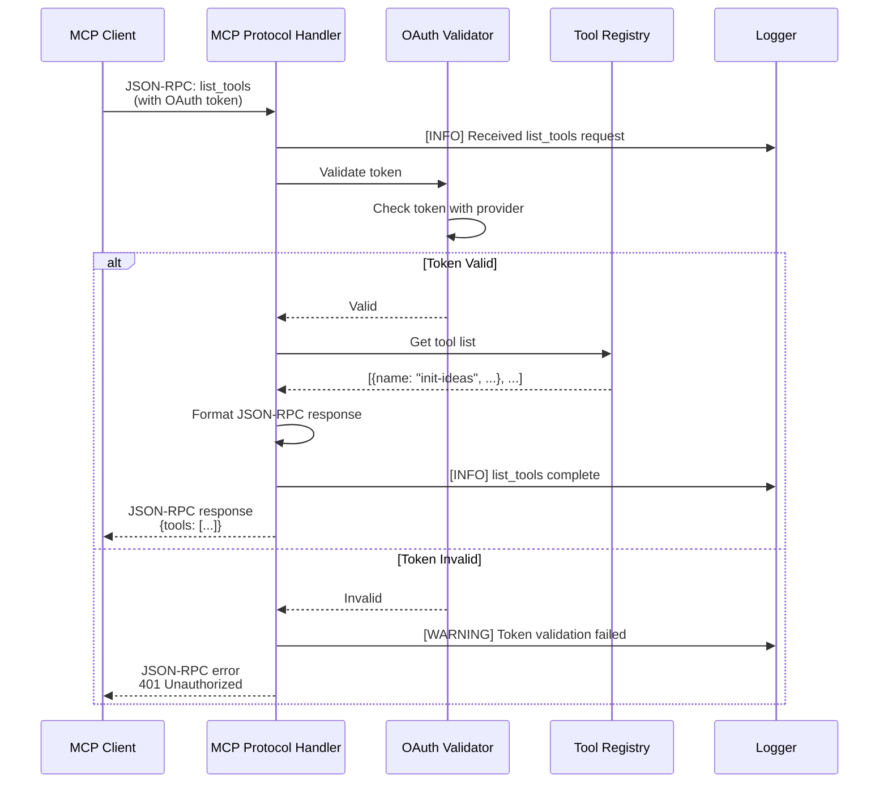
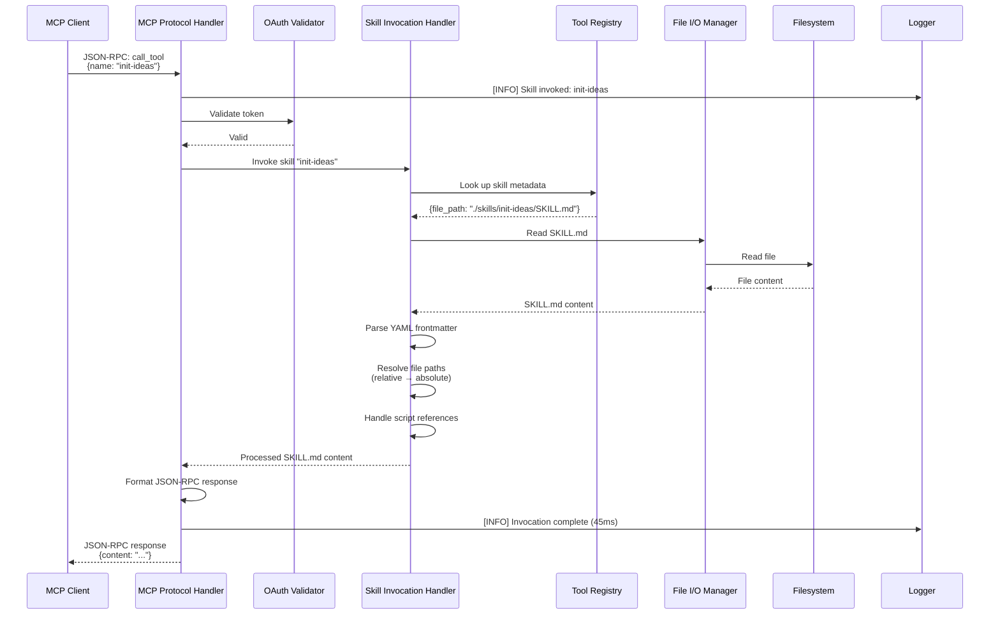
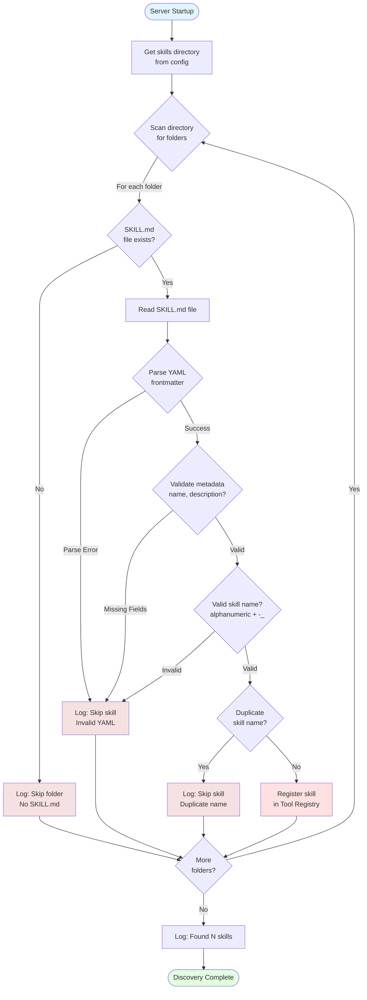
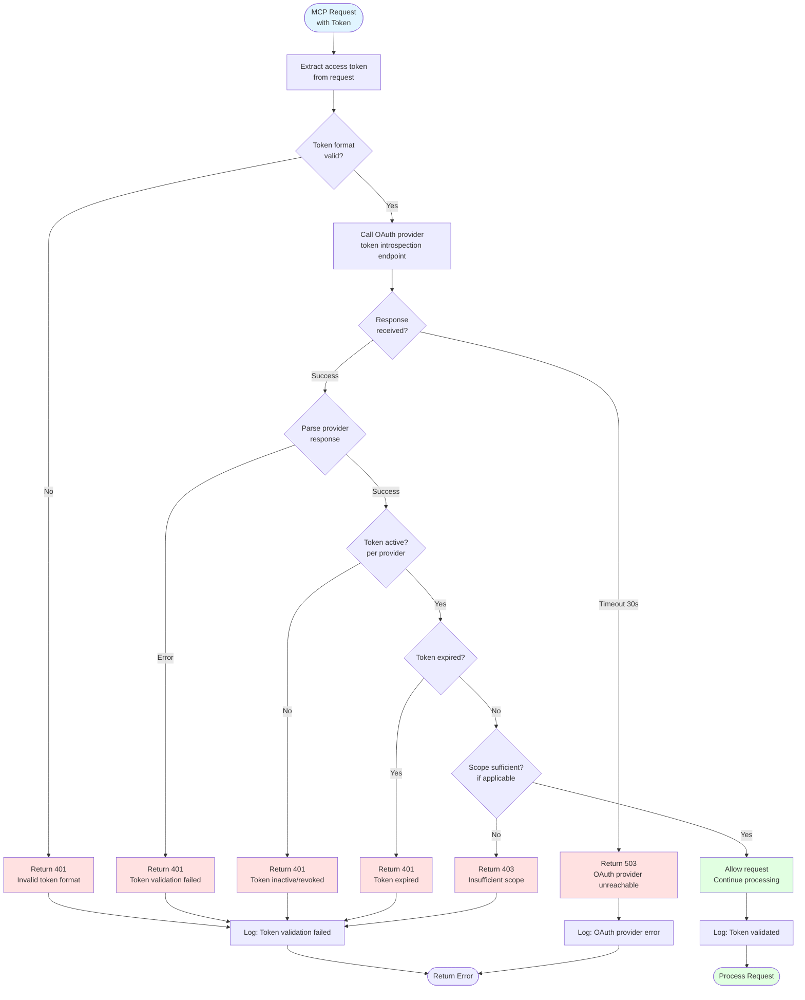
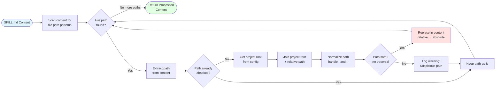

# Architecture Diagrams - MCP Skills Server

## Overview

This document provides visual diagrams of the MCP Skills Server architecture using Mermaid notation.

---

## Diagram 1: High-Level System Architecture

This diagram shows the overall system architecture with all major components and external dependencies.

**Diagram Legend**:
- **Blue**: External client
- **Red**: Critical components
- **Green**: External dependencies
- **Purple**: Third-party services
- **Solid lines**: Data flow
- **Dotted lines**: Logging

---

## Diagram 2: Component Dependency Graph

This diagram shows the dependencies between internal components (which components depend on which).

**Dependency Levels**:
- **Level 0**: Configuration Manager (no dependencies)
- **Level 1**: Logger (depends on Config)
- **Level 2**: File I/O Manager, OAuth Validator (depend on Logger, Config)
- **Level 3**: Skill Discovery, Tool Registry (depend on lower levels)
- **Level 4**: MCP Protocol Handler, Skill Invocation (depend on all below)
- **Level 5**: CLI Entry Point (orchestrates all)

---

## Diagram 3: Server Startup Sequence

This diagram shows the initialization sequence when the server starts.

**Startup Time**: Target <2 seconds (measured in logs)

---

## Diagram 4: MCP Request Flow (list_tools)

This diagram shows what happens when an MCP client requests the list of available tools.

**Response Time**: <50ms (no file I/O, just registry lookup)

---

## Diagram 5: MCP Request Flow (call_tool)

This diagram shows the complete flow for invoking a skill.

**Response Time**: Target <100ms (includes file I/O)

---

## Diagram 6: Skill Discovery Process

This diagram shows how skills are discovered during server startup.

**Discovery Strategy**: Fail-safe (skip invalid skills, continue discovery)

---

## Diagram 7: OAuth Validation Flow

This diagram shows how OAuth 2.1 tokens are validated.

**Security**: Fail-secure (reject on any validation failure)

---

## Diagram 8: File Path Resolution Process

This diagram shows how relative paths in SKILL.md are resolved to absolute paths.

**Example**:
- Input: `See 00-init-ideas/README.md`
- Output: `See /Users/maya/projects/dev-swarms/00-init-ideas/README.md`

---

## Diagram Summary

| Diagram | Purpose | Complexity |
|---------|---------|------------|
| 1. High-Level Architecture | Overall system structure | Medium |
| 2. Component Dependencies | Component relationships | Low |
| 3. Startup Sequence | Initialization flow | Medium |
| 4. list_tools Flow | Simple MCP request | Low |
| 5. call_tool Flow | Complex MCP request | High |
| 6. Skill Discovery | Discovery algorithm | High |
| 7. OAuth Validation | Security flow | High |
| 8. Path Resolution | Content processing | Medium |

**Total Diagrams**: 8 comprehensive visualizations

---

Last updated: 2025-12-26
