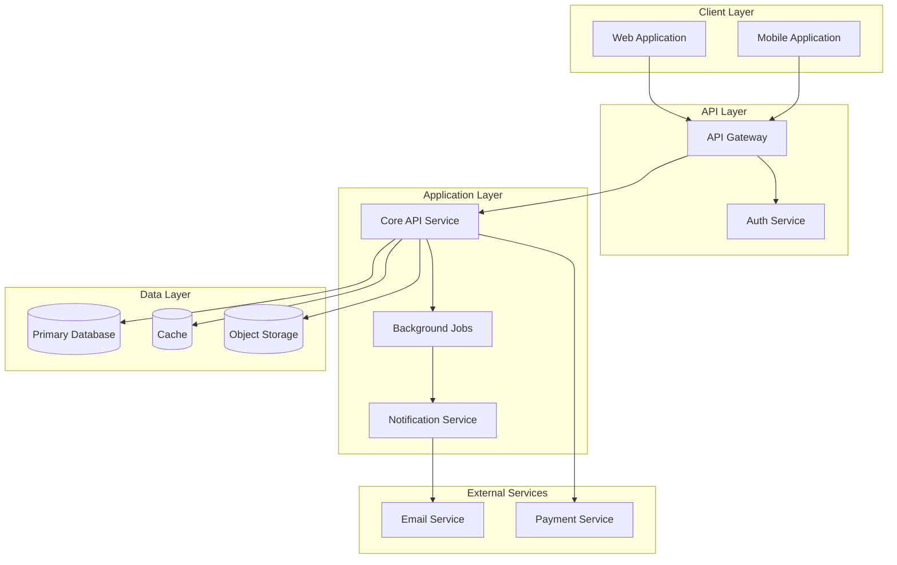
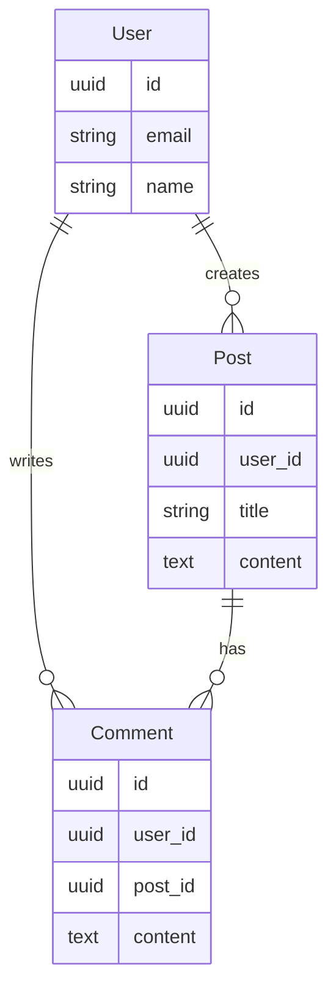

# 06-architecture deliverables

Only present files that are suitable for the project's type and level; omit the rest.

## Deliverable list

- system-overview.md: Components, responsibilities, and interactions.
- architecture-diagram.md: System diagrams using Mermaid.
- data-flow.md: Request/data flow details for critical journeys.
- deployment-boundaries.md: Environments, trust boundaries, and scaling assumptions.

## File content guidance

### README.md

- Stage overview and objectives
- Owners: Tech Manager (lead), Backend Architect, Frontend Architect, DevOps Engineer
- Summary of architectural approach and principles
- Links to all architecture documentation files
- Key architectural decisions and rationale

### system-overview.md

Define the major system components and their responsibilities:

1. **Architectural Principles:**
   - Guiding principles (separation of concerns, scalability, security by design, API-first, etc.)

2. **System Components:**

```
### Component: [Component Name]

**Type:** Frontend / Backend / Database / External Service / Infrastructure

**Responsibility:**
- What this component does
- What problems it solves
- What it is NOT responsible for

**Key Capabilities:**
- Capability 1
- Capability 2
- Capability 3

**Interfaces:**
- Inputs: What data/requests it receives
- Outputs: What data/responses it produces
- APIs: What APIs it exposes (if any)

**Dependencies:**
- What other components does this depend on?
- What external services does this use?

**Data Storage:**
- What data does this component store?
- Where is it stored?

**Scalability:**
- Can this scale horizontally or vertically?
- What are the scaling constraints?
```

3. **Component Categories:**
   - Frontend components (web, mobile, desktop, admin)
   - Backend components (API gateway/BFF, core services, auth, jobs, notifications)
   - Data components (DB, cache, search, storage, queue)
   - External services (payments, email, SMS, auth providers, CDN, monitoring)

4. **Component Interaction Patterns:**
   - Request-response, event-driven, pub-sub, polling vs. webhooks, WebSocket

### architecture-diagram.md

Create visual diagrams showing system architecture:

1. **High-Level Architecture Diagram:**



2. **Component Detail Diagrams:**
   - Authentication flow diagram
   - Payment processing flow
   - File upload/download flow
   - Real-time messaging flow (if applicable)

3. **Database Schema Diagram (High-Level):**



### data-flow.md

Document how data flows through the system:

1. **Request Flow (Frontend to Backend):**

```
### Flow: [User Flow Name]

**Trigger:** User action that initiates the flow (from 05-ux/user-flows.md)

**Step-by-Step Data Flow:**

1. **User Action:** User clicks/submits/interacts
   - Component: [Frontend Component]
   - Data: [What data is involved]

2. **API Request:**
   - Component: Frontend -> API Gateway
   - Method: GET/POST/PUT/DELETE
   - Endpoint: /api/resource
   - Request Data: { ... }
   - Headers: [Authentication, Content-Type, etc.]

3. **Authentication/Authorization:**
   - Component: API Gateway -> Auth Service
   - Validation: [What is checked]
   - Result: [Pass/Fail action]

4. **Business Logic Processing:**
   - Component: Core API Service
   - Processing: [What happens to the data]
   - Validation: [Business rules applied]
   - Transformations: [Data transformations]

5. **Database Operations:**
   - Component: Core API -> Database
   - Operation: SELECT/INSERT/UPDATE/DELETE
   - Tables: [Which tables affected]
   - Transactions: [If transaction needed]

6. **External Service Calls (if any):**
   - Component: Core API -> External Service
   - Service: [Which external service]
   - Purpose: [Why calling it]
   - Fallback: [What if service fails]

7. **Response Construction:**
   - Component: Core API
   - Data: [Response data structure]
   - Status: [HTTP status code]

8. **Response to Frontend:**
   - Component: API Gateway -> Frontend
   - Data: { ... }
   - Frontend Action: [How UI updates]

**Error Handling:**
- What happens if step X fails?
- Rollback strategy
- Error messages to user

**Caching Strategy:**
- What data is cached?
- Where is it cached?
- Cache invalidation rules

**Performance Considerations:**
- Expected latency
- Database query optimization
- N+1 query prevention
```

2. **Data Flow Categories:**
   - Read flows, write flows, delete flows
   - File upload flows
   - Background processing flows
   - Real-time flows (WebSocket/SSE)

3. **Data Transformation Pipeline:**
   - Input validation and sanitization
   - Data normalization
   - Business logic application
   - Response formatting
   - Error formatting

### deployment-boundaries.md

Define what runs where and security/trust boundaries:

1. **Deployment Environments:**
   - Development (local/dev cloud)
   - Staging (production-like testing)
   - Production (live user-facing)

2. **What Runs Where:**
   - Client-side (browser/mobile/desktop)
   - Edge/CDN (static assets, cached responses)
   - Cloud application layer (APIs, auth, jobs)
   - Cloud data layer (DB, cache, storage, queues)
   - Third-party services (email, payments, analytics, monitoring)

3. **Trust Boundaries:**
   - User device <-> Cloud
   - Public API <-> Internal services
   - Application <-> Database
   - Application <-> External services

4. **Scaling Assumptions:**
   - Vertical scaling vs. horizontal scaling
   - Auto-scaling triggers
   - Database scaling strategy
   - CDN and caching strategy

5. **High Availability and Fault Tolerance:**
   - Multi-AZ deployment
   - Database failover
   - Service redundancy
   - Circuit breakers and graceful degradation

6. **Geographic Distribution (if applicable):**
   - Multi-region deployment
   - Data residency requirements
   - Latency optimization
   - CDN edge locations
