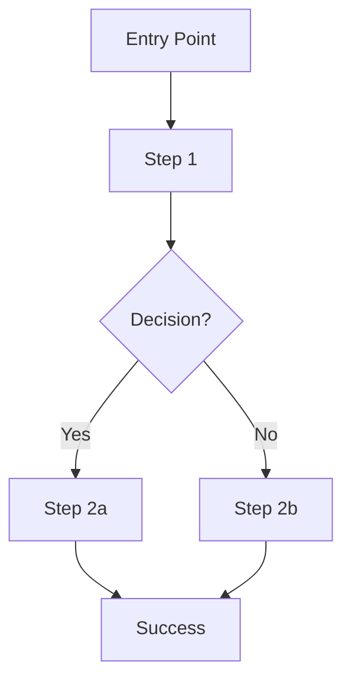

# 05-ux deliverables

Only present files that are suitable for the project's type and level; omit the rest.

## Deliverable list

- user-flows.md: Critical user journeys. Needed for UI products.
- interaction-specs.md: UI states and behaviors. Needed for complex interactions.
- edge-cases.md: Edge cases and error handling. Needed for robust flows.
- accessibility.md: Accessibility goals and checks. Needed for public-facing apps.
- mockups/: Screens or wireframes. Needed for UI-based apps.

## File content guidance

### user-flows.md

Define user flows with diagrams and descriptions.

**Critical User Flows:**
For each critical flow from the PRD:

```
### Flow: [Flow Name]

**Related Requirements:** [FR-XXX, FR-YYY from PRD]
**User Persona:** [Primary/Secondary persona]
**Goal:** What the user wants to accomplish

**Flow Steps:**
1. **Entry Point:** Where does the user start?
   - Screen/page: [Name]
   - Trigger: [What initiates this flow]

2. **Step 1:** [Action/Screen]
   - User action: [What user does]
   - System response: [What happens]
   - Next state: [Where user goes]

3. **Step 2:** [Action/Screen]
   - User action: [What user does]
   - System response: [What happens]
   - Next state: [Where user goes]

... continue for all steps ...

N. **Success State:** [End goal achieved]
   - Screen/page: [Name]
   - Confirmation: [How user knows they succeeded]

**Alternative Paths:**
- If [condition]: User goes to [alternative step]
- If [error condition]: Show [error state]

**Flow Diagram:** (Use Mermaid or text-based diagram)
```

Use Mermaid diagrams when possible:



**User Flow Categories:**
- Onboarding flow: First-time user experience
- Authentication flows: Login, signup, password reset
- Core feature flows: Main user journeys for key features
- Settings and profile flows: User account management
- Error and recovery flows: What happens when things go wrong

### interaction-specs.md

Define interaction rules, states, and transitions.

**Component States:**
For each interactive component:

```
### Component: [Component Name]

**States:**
- **Default**: Normal state appearance and behavior
- **Hover**: When user hovers (desktop only)
- **Focus**: When component has keyboard focus
- **Active/Pressed**: When user clicks/taps
- **Disabled**: When component is not interactive
- **Loading**: When action is in progress
- **Error**: When validation fails or error occurs
- **Success**: When action completes successfully

**Transitions:**
- Default -> Hover: [How it changes]
- Hover -> Active: [How it changes]
- Active -> Loading: [How it changes]
- Loading -> Success/Error: [How it changes]

**Interaction Rules:**
- Click/tap behavior: [What happens]
- Keyboard interaction: [Enter, Space, Arrow keys, etc.]
- Screen reader behavior: [What is announced]
```

**Interaction Patterns:**
- Buttons: Primary, secondary, tertiary, icon buttons
- Forms: Input fields, dropdowns, checkboxes, radio buttons
- Navigation: Menus, tabs, breadcrumbs
- Feedback: Toast notifications, alerts, modals, confirmations
- Loading states: Spinners, skeleton screens, progress indicators
- Animations and transitions: Durations, easing functions

**Touch and Gesture Support (if mobile/tablet):**
- Tap targets (minimum 44x44px)
- Swipe gestures
- Pull to refresh
- Long press actions

### edge-cases.md

Define edge cases and expected outcomes.

**Data Edge Cases:**

```
### Edge Case: [Scenario Name]

**Scenario:** What is the unusual condition?

**Examples:**
- Empty state: No data available
- Very long text: Name with 200 characters
- Special characters: Unicode, emojis, symbols
- Large numbers: Billions, scientific notation
- Zero values: Empty cart, $0.00 balance

**Expected Behavior:**
- What should the UI show?
- How should the system handle it?
- What message should the user see?

**Mockup Reference:** [Link to mockup showing this state]
```

**Edge Case Categories:**
- Empty states: No content, no results, no data
- Extreme values: Very large, very small, zero, negative
- Boundary conditions: Max length, min length, limits reached
- Unusual input: Special characters, different languages, emojis
- Network issues: Offline, slow connection, timeout
- Permission issues: Access denied, unauthorized
- Concurrent actions: Multiple users, race conditions

**Error Scenarios:**
- Validation errors: Invalid input, missing required fields
- System errors: Server errors, database errors, API failures
- Business logic errors: Insufficient balance, item out of stock
- User errors: Wrong password, duplicate email, expired session

### accessibility.md

Define accessibility requirements and checklist.

**Accessibility Standards:**
- Target compliance: WCAG 2.1 Level AA (or higher)
- Supported assistive technologies:
  - Screen readers (NVDA, JAWS, VoiceOver)
  - Keyboard navigation
  - Voice control
  - Screen magnification

**WCAG 2.1 Checklist:**

**Perceivable:**
- [ ] All images have alt text
- [ ] Color is not the only means of conveying information
- [ ] Text has sufficient contrast (4.5:1 for normal text, 3:1 for large text)
- [ ] Content is responsive and adapts to different screen sizes
- [ ] Videos have captions and transcripts
- [ ] Audio content has transcripts

**Operable:**
- [ ] All functionality available via keyboard
- [ ] No keyboard traps
- [ ] Skip navigation links provided
- [ ] Focus order is logical
- [ ] Focus indicator is visible
- [ ] Interactive elements have minimum 44x44px touch target
- [ ] No content flashes more than 3 times per second

**Understandable:**
- [ ] Language of page is declared (lang attribute)
- [ ] Navigation is consistent across pages
- [ ] Forms have clear labels and instructions
- [ ] Error messages are clear and helpful
- [ ] Form validation provides specific feedback

**Robust:**
- [ ] Valid HTML markup
- [ ] ARIA labels used correctly
- [ ] Compatible with current and future assistive technologies

**Keyboard Navigation:**
- Tab order and focus management
- Keyboard shortcuts (if any)
- Escape key behavior (close modals, cancel actions)
- Enter/Space key behavior (activate buttons, submit forms)

**Screen Reader Support:**
- ARIA labels and roles
- Live regions for dynamic content
- Meaningful link text (not "click here")
- Form field labels and error associations

### mockups/ (CRITICAL for UI-based applications)

Create interactive HTML/CSS/JS mockups to showcase the product.

**Purpose of Mockups:**
- Visualize the product for non-technical stakeholders
- Define theme, style, and branding (colors, fonts, spacing)
- Showcase basic user flows interactively
- Serve as a project proposal to help customers understand what they'll get
- Provide a reference for developers during implementation

**mockups/index.html:**

Create a static HTML mockup with:

1. **Structure:**
   - Proper HTML5 document structure
   - Navigation section for site navigation
   - Main content area with multiple screen sections
   - Footer section
   - Link to styles.css and script.js

2. **What to Include:**
   - Multiple key screens: Home, main features, settings, profile
   - Interactive navigation: Click to switch between screens
   - Component examples: Buttons, forms, cards, modals
   - State examples: Default, hover, active, disabled, loading, error
   - Responsive design: Works on desktop, tablet, mobile
   - Real content examples: Use realistic text and data (avoid lorem ipsum)

**mockups/styles.css:**

Define the complete design system:

1. **CSS Variables for Theme:**
   - Define color palette (primary, secondary, accent, background, surface, text, border, semantic colors)
   - Define typography (font families, font sizes, font weights, line heights)
   - Define spacing system (xs, sm, md, lg, xl, 2xl)
   - Define border radius values (sm, md, lg, full)
   - Define shadow values (sm, md, lg)
   - Define transition timing (fast, base, slow)

2. **Component Styles:**
   - Buttons (primary, secondary, outline, ghost)
   - Forms (inputs, selects, checkboxes, radio buttons)
   - Cards and containers
   - Navigation (navbar, sidebar, tabs)
   - Modals and dialogs
   - Alerts and notifications
   - Tables and lists
   - Loading states and skeletons

3. **Responsive Breakpoints:**
   - Define breakpoints for mobile, tablet, desktop, and wide screens
   - Implement responsive behavior with media queries

**mockups/script.js:**

Add interactivity to the mockup:

1. **Screen Navigation:**
   - Implement navigation function to switch between screens/pages
   - Hide inactive screens and show active screen
   - Handle navigation events (clicks on nav links)

2. **Interactive Elements:**
   - Button click handlers
   - Form interactions (show validation states)
   - Modal open/close
   - Dropdown menus
   - Tab switching
   - Accordion expand/collapse
   - Toast notifications

3. **State Demonstrations:**
   - Show loading states
   - Show error states
   - Show success states
   - Show empty states

**mockups/assets/:**

Include any visual assets:
- Logo (SVG preferred)
- Icons (use icon libraries like Font Awesome or create custom SVGs)
- Sample images (if needed for mockup)
- Custom fonts (if not using web fonts)

## Mockup Best Practices (UI-Based Applications)

1. Use realistic content: Avoid lorem ipsum, use actual product-like content
2. Show multiple states: Default, hover, active, loading, error, success, empty
3. Make it interactive: Allow clicking through key flows
4. Keep it simple: Focus on showcasing design
5. Use design system: Define colors, fonts, spacing in CSS variables
6. Show responsiveness: Test on mobile, tablet, desktop sizes
7. Include branding: Logo, color palette, typography that represent the brand
8. Document theme: Comment the CSS to explain design decisions

## Why Mockups Matter

For UI-based applications, mockups serve multiple purposes:
- Stakeholder buy-in: Non-technical customers can see and interact with what they are getting
- Design validation: Test the design before writing production code
- Developer reference: Provides exact spacing, colors, fonts for implementation
- User testing: Can be used to test flows with real users
- Proposal tool: Helps sell the product vision to investors or clients
- Alignment: Ensures everyone has the same visual understanding
